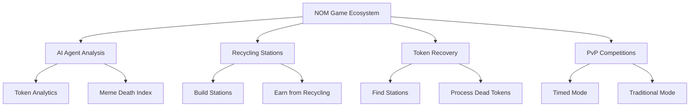
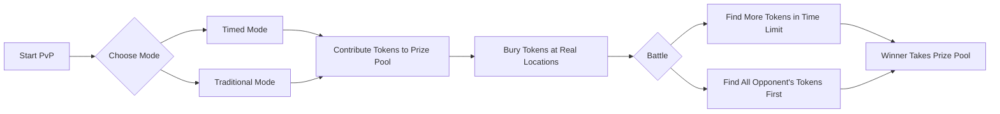
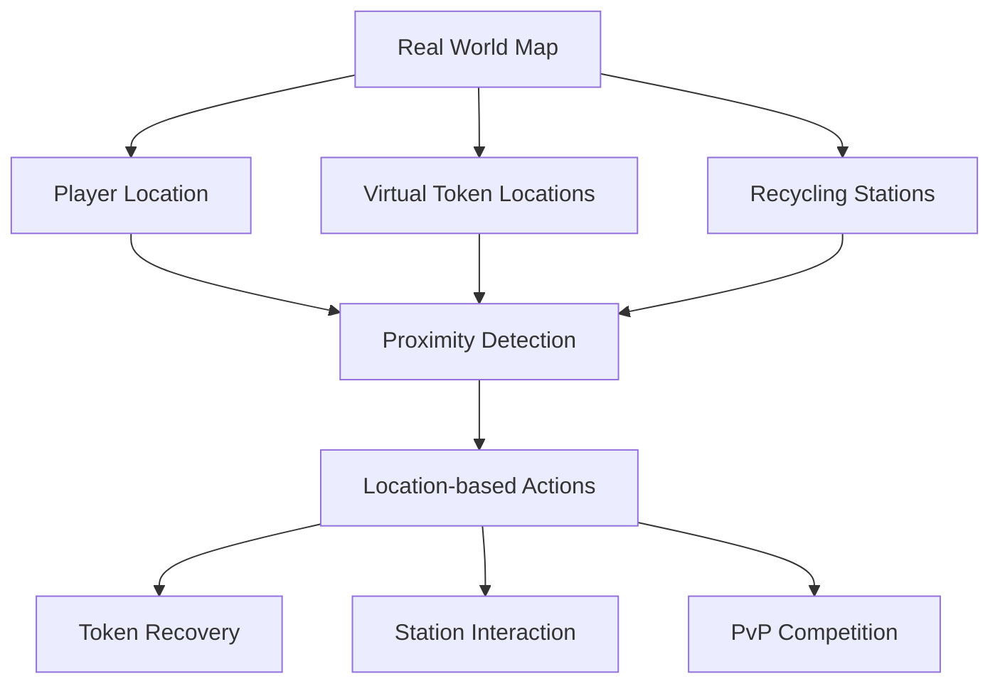

# NOM GAME

*Turning dead meme tokens into treasure hunts*

## Overview

Nom Game is an innovative blockchain-based game that combines real-world geolocation with cryptocurrency, specifically focusing on "dead" meme tokens. Players can analyze, collect, trade, and compete with defunct meme tokens through a unique treasure hunting mechanism mapped to real-world locations.

## Core Features

### 1. AI Agent Analytics (Under development)

Our advanced AI chatbot provides real-time analysis of meme tokens:

- Simply input a token ticker or contract address
- Receive instant analysis of the token's "death index"
- Get comprehensive data analysis on token performance
- Learn about token history and market context

### 2. Recycling Station Ownership (Finished)

Build your own infrastructure in the Nom ecosystem:

- Create recycling stations at real-world locations
- Become a station master and establish your territory
- Earn rewards from other players who use your station
- Upgrade stations to increase capacity and earning potential

### 3. Token Recovery Missions (Under development)

Turn worthless assets into gameplay elements:

- Locate recycling stations on the real-world map
- Process dead meme tokens for in-game value
- Convert otherwise worthless tokens into gameplay assets
- Collect and trade recovered tokens

### 4. PvP Competition Modes (Finished)

Compete against other players in token-based battles:

#### Timed Mode (Under development)
- Both players contribute dead meme tokens to a prize pool
- Tokens are virtually "buried" at random real-world locations
- Players have a time limit to find as many tokens as possible
- The player who recovers more tokens wins the entire prize pool

#### Traditional Mode (Finished)
- Both players contribute dead meme tokens to a prize pool
- Each player buries their tokens at selected real-world locations
- First player to find all of their opponent's tokens wins
- Winner claims the entire prize pool

## Gameplay Integration with Real World (Finished)

Nom Game seamlessly integrates virtual gameplay with physical locations:

- Uses GPS and map data to track player movements
- Requires physical presence at locations to interact
- Creates an augmented reality treasure hunting experience
- Encourages exploration of real-world environments

## Token Economics

Nom Game creates utility for otherwise "dead" meme tokens:

- Tokens with low trading volume or value become game assets
- Building recycling infrastructure creates new token utility
- PvP competitions add competitive value to defunct tokens
- Creates a secondary market for previously abandoned assets

## Getting Started

1. [Git clone this repository]

2. npm install

3. npm start

## Community & Support

- Join our Telegram Group and Channel for strategy discussions, we'd like to dear advices on further development
- Follow us on Twitter for updates
- Visit our website at nomme.xyz

---

*Nom Game: Where dead memes find new life.*
